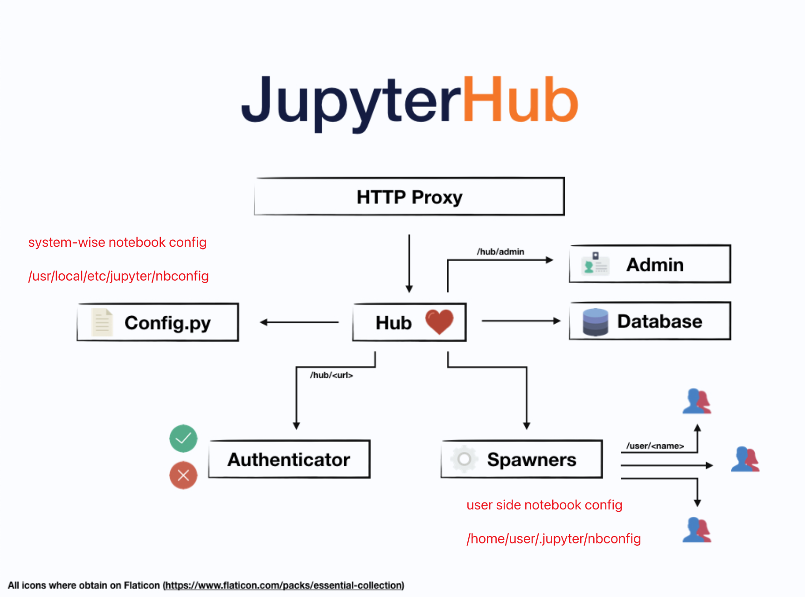

# Jupyter WorkStation

Jupyterhub + nbextension + templates + GPU driver support (if necessary)

</img>

Detail Settings : 

1. use jupyterhub 1.5.1 for stability
2. use LocalAuthenticator (create user in system)
3. put `jupyterhub_config.py` into `srv/jupyterhub/jupyterhub_config.py`
4. (GCE) deploy jupyterhub.service from `/opt/jupyterhub/etc/systemd/jupyterhub.service` to `/etc/systemd/system/jupyterhub.service` (soft link)

# User Management

## add user

### Docker
* by jupyterhub GUI (without password)
* root `useradd` username (X) - wrong folder path
* root `passwd` userpassword

### GCE
* root `useradd` username (X) - wrong folder path
* root `passwd` userpassword

## delete user
### Docker
* root userdel uname 
* root userdel -r uname (folders & buffers)

### GCE

* be careful! - we should delete any user registered on the workstation.

ref : https://blog.csdn.net/weixin_48114253/article/details/117548513

# NOTE

* pre-study on GCE : 4hr
* develop using docker : 2+4 hr
* develop using gcloud : 2+3 hr
* Total : 15hr
